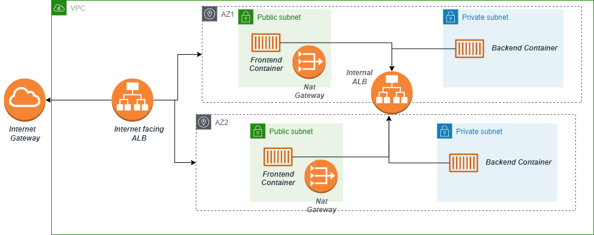

## Architecture

- VPC
- Public/private subnets deployed in 2 AZs
- Internal load balancing for inter-communication between ECS services
- Nat Gateways: to allow containers to reach the internet without being exposed
- ECS cluster composed of 2 services frontend service and backend service
- Frontend service deployed in the public subnet 
- Backend service deployed in the private subnet
- Internet facing Loadbalancer + Internet Gateway to expose the frontend Containers

## Goal 

This architecture aims to deploy a microservices architecture in a vpc within a Fargate-based ECS cluster

Establishing communication between ECS services, is quite challenging so this folder is to help you solve the challenge.
