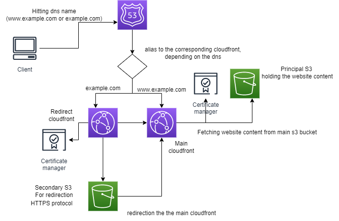

## Architecture

- Route53
- 2 CloudFront. One is main and the other is for redirection 
- 2 buckets. One is main and the other is for redirection
- ACM certificate that holds the main dns name (example.com) and sub domain with www (www.example.com)

## Goal 

This architecture aims to deploy static website using a fully serverless architecture

## The choice of this architecture

- Cost. This architecture is the cheapest compared to a server based or container based (fargate) one
- Serverless
- Scalable, can respond to high demand

## Important notes

- You need to upload your website content or build the main S3 Bucket manually, via console or s3api, we can't do it through Cloudformation

- If you bought your domain from another domain provider the deploy will fail, due to ACM who can't validate the ssl certificate, you need manual intervertion to solve the issue

## How to ?

- Just deploy the cloudformation stack, and you'll have the result in your AWS console.
- Hit your domain name and see the result